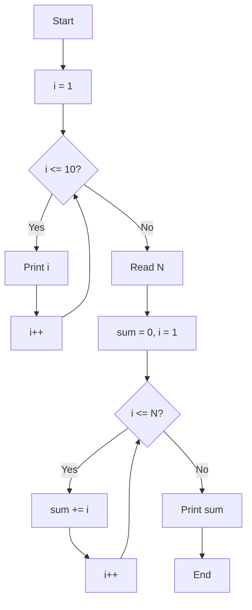
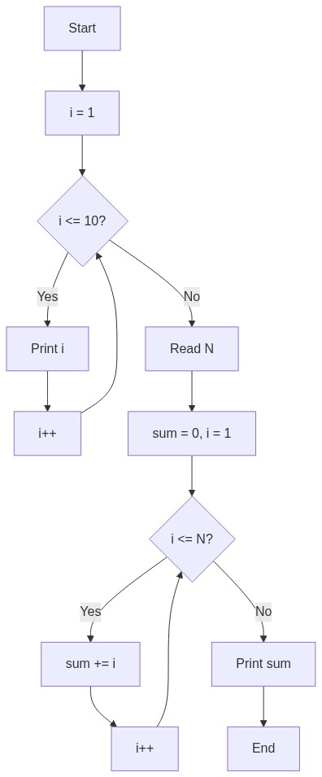

# المحاضرة الخامسة: حلقات التكرار

---

## برامج منفصلة لكل مفهوم

| البرنامج | الملف | المفهوم |
|----------|-------|---------|
| `for` loop | `lecture_05a_for_loop.asm` | `bgt`, `addi`, `b` |
| `while` loop | `lecture_05b_while_loop.asm` | `bgt`, `add`, `addi` |

---

## شرح كل أمر

### بنية الحلقة في Assembly

في C++: `for (int i = 0; i < 10; i++)`
في Assembly لا يوجد `for`/`while` — نستخدم تعليمات القفز (branch).

```
    li $t0, 1          # تهيئة: i = 1
loop:
    bgt $t0, 10, end   # شرط: إن كان i > 10 → اخرج
    ... body ...       # جسم الحلقة
    addi $t0, $t0, 1    # تحديث: i++
    b loop             # تكرار: عد
end:
```

### `bgt $t0, 10, done_print`

إن كان `$t0 > 10`، اذهب إلى `done_print` (اخرج من الحلقة). هذا شرط الخروج.
حين يصل العداد إلى 11، نتوقف.

**لماذا نتوقف عند `$t0 > 10` وليس `$t0 == 10`؟** لأنه إن تخطينا 10 خطأً، الحلقة لن تتوقف!

### `addi $t0, $t0, 1`

- **addi** = Add Immediate (جمع مع قيمة فورية)
- `$t0 = $t0 + 1` مثل `i++` في C++
- الحرف `i` = Immediate — الرقم 1 قيمة مباشرة وليس مسجلاً

### `add $t3, $t3, $t2`

`$t3 = $t3 + $t2` (مجموع تراكمي). مثل `sum += i` في C++.

---

## الكود

```mips
.data
    space:   .asciiz " "
    newline: .asciiz "\n"
    prompt:  .asciiz "Enter N: "
    sum_msg: .asciiz "Sum = "

.text
main:
    # ========================================
    # مثال F: for — اطبع 1 2 3 4 5 6 7 8 9 10
    # C++: for (int i = 1; i <= 10; i++) cout << i << " ";
    # ========================================
    li $t0, 1                    # $t0 = 1   (العداد i)

print_loop:
    bgt $t0, 10, done_print      # إذا i > 10 → اخرج

    move $a0, $t0                # اطبع i
    li $v0, 1
    syscall
    la $a0, space
    li $v0, 4
    syscall

    addi $t0, $t0, 1             # $t0++  (C++: i++;)
    b print_loop

done_print:
    la $a0, newline
    li $v0, 4
    syscall

    # ========================================
    # مثال G: while — مجموع 1+2+3+...+N
    # C++:
    #   int N; cin >> N;
    #   int sum = 0, i = 1;
    #   while (i <= N) { sum += i; i++; }
    #   cout << sum;
    # ========================================
    la $a0, prompt
    li $v0, 4
    syscall
    li $v0, 5
    syscall
    move $t1, $v0                # $t1 = N

    li $t2, 1                    # $t2 = i
    li $t3, 0                    # $t3 = sum

sum_loop:
    bgt $t2, $t1, done_sum       # إذا i > N → اخرج
    add $t3, $t3, $t2            # sum += i
    addi $t2, $t2, 1             # i++
    b sum_loop

done_sum:
    la $a0, sum_msg
    li $v0, 4
    syscall
    move $a0, $t3
    li $v0, 1
    syscall

    li $v0, 10
    syscall
```

---

## خلاصة التعليمات الجديدة

| الأمر | المعنى | المقابل في C++ |
|-------|--------|----------------|
| `addi $t, $s, n` | `$t = $s + n` (جمع مع رقم ثابت) | `t = s + n` |

### بنية الحلقة

| الخطوة | الكود | المقابل في C++ |
|--------|-------|----------------|
| التهيئة | `li $counter, start` | `int i = start;` |
| الشرط | `bgt $counter, limit, exit` | `while (i <= limit)` |
| الجسم | `...` | `body` |
| التحديث | `addi $counter, $counter, 1` | `i++` |
| التكرار | `b loop` | `}` (عد مرة أخرى) |

> **ملاحظة:** نستخدم `bgt` (أكبر من) للخروج. الحلقة تستمر طالما `i <= limit`، وتتوقف عندما `i > limit` (أي `bgt`). هذا عكس شرط C++ مباشرة.

---

## مخطط سير الخوارزمية (Flowchart)




