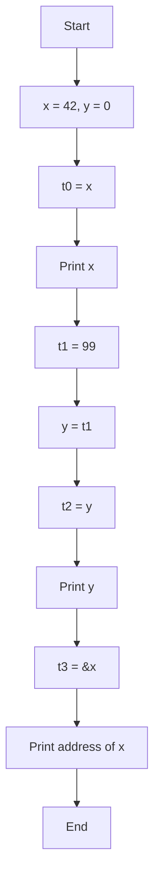
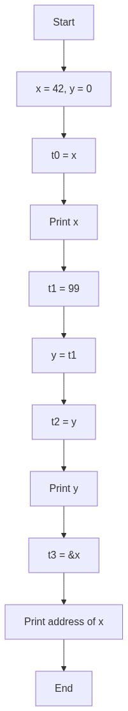

# المحاضرة السادسة: التعامل مع الذاكرة

---

## برامج منفصلة لكل مفهوم

| البرنامج | الملف | المفهوم |
|----------|-------|---------|
| قراءة من RAM | `lecture_06a_lw.asm` | `lw` (Load Word) |
| كتابة إلى RAM | `lecture_06b_sw.asm` | `sw` (Store Word) |
| عنوان vs قيمة | `lecture_06c_la.asm` | `la` (Load Address) |

---

## شرح كل أمر

### الفرق بين Register و Memory

| | Register (`$t0`) | Memory (RAM) |
|---|-------------------|--------------|
| السرعة | الأسرع | أبطأ بكثير |
| الحجم | 32 bits فقط | ملايين البايتات |
| العدد | 32 فقط | غير محدود نظرياً |

المعالج - لكي يجلب 42 - يجب أن يجلبها من RAM إلى register أولاً.

### `x: .word 42`

- **`.word`** = احجز 4 بايت (32 bits) في RAM وسمّه `x`، ضع القيمة 42 فيه
- في C++: `int x = 42;` (x في RAM أيضاً)
- `x` = label في الذاكرة (عنوان)

### `lw $t0, x`

- **lw** = Load Word (احمل كلمة = 4 بايت)
- اذهب إلى الذاكرة عند عنوان `x`، أحضر الـ 4 بايت التي هناك وضعهم في `$t0`
- في C++: `t0 = x;` (اقرأ قيمة x)
- **تذكر:** `lw` تقرأ من RAM، `li` مختلف: يضع قيمة مباشرة في register

### `sw $t1, y`

- **sw** = Store Word (خزّن كلمة)
- خذ قيمة `$t1` وضعها في RAM عند عنوان `y`
- في C++: `y = t1;` (اكتب في y)
- `sw` عكس `lw`: `lw` = RAM ← register, `sw` = register → RAM

### `la $t3, x`

- **la** = Load Address (احمل العنوان)
- `$t3` = عنوان `x` في RAM، وليس قيمة `x`
- في C++: `t3 = &x;` (عنوان x)

### الفرق بين la و lw (مهم جداً)

| الأمر | المعنى | C++ مقابل |
|-------|--------|-----------|
| `la $t0, x` | `$t0` = عنوان x | `t0 = &x` |
| `lw $t0, x` | `$t0` = قيمة x | `t0 = x` |

### `syscall 34`

اطبع رقماً بصيغة hex (النظام الست عشري). لنرى العناوين التي في RAM.

---

## الكود

```mips
.data
    x: .word 42                # int x = 42;
    y: .word 0                 # int y = 0;
    msg_x:  .asciiz "x = "
    msg_y:  .asciiz "y = "
    addr_x: .asciiz "Address of x = 0x"
    newline: .asciiz "\n"

.text
main:
    # --- مثال: lw — اقرأ من RAM (C++: int t0 = x;) ---
    la $a0, msg_x
    li $v0, 4
    syscall
    lw $t0, x                   # $t0 = قيمة x   (C++: t0 = x;)
    move $a0, $t0
    li $v0, 1
    syscall
    la $a0, newline
    li $v0, 4
    syscall

    # --- مثال: sw — اكتب إلى RAM (C++: y = 99;) ---
    li $t1, 99
    sw $t1, y                   # y = 99   (C++: y = t1;)
    la $a0, msg_y
    li $v0, 4
    syscall
    lw $t2, y                   # اقرأ y للتحقق
    move $a0, $t2
    li $v0, 1
    syscall
    la $a0, newline
    li $v0, 4
    syscall

    # --- مثال: la مقابل lw — عنوان vs قيمة ---
    # la تعطي العنوان (C++: t3 = &x;)
    # lw تعطي القيمة (C++: t0 = x;)
    la $a0, addr_x
    li $v0, 4
    syscall
    la $t3, x                   # $t3 = عنوان x
    move $a0, $t3
    li $v0, 34                  # اطبع hex
    syscall

    li $v0, 10
    syscall
```

---

## خلاصة التعليمات الجديدة

| الأمر | المعنى | C++ مقابل |
|-------|--------|-----------|
| `.word n` | احجز 4 بايت في RAM, قيمة = n | `int x = n;` |
| `lw $t, label` | Load Word: RAM → register | `t = x` |
| `sw $t, label` | Store Word: register → RAM | `x = t` |
| `la $t, label` | Load Address: `$t = &label` | `t = &x` |
| `syscall 34` | اطبع hex | `cout << hex << x` |

---

## مخطط سير الخوارزمية (Flowchart)




