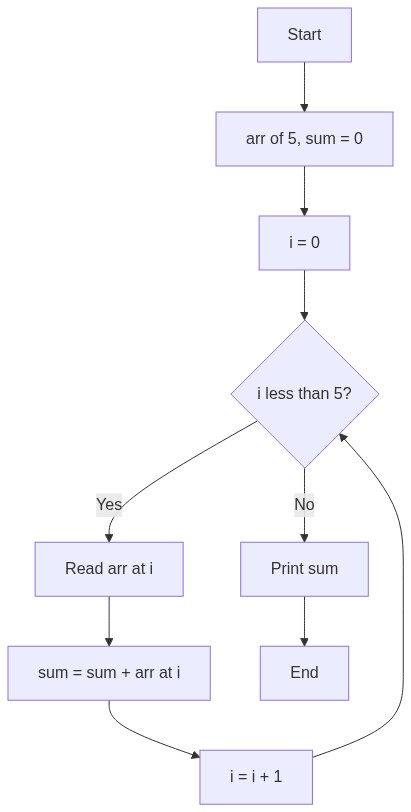

# المحاضرة السابعة: المصفوفات

---

## برامج منفصلة لكل مفهوم

| البرنامج | الملف | المفهوم |
|----------|-------|---------|
| إدخال المصفوفة | `lecture_07a_input.asm` | `sw`, `sll` مع حلقة |
| حساب المجموع | `lecture_07b_sum.asm` | `lw`, `sll` مع حلقة |

---

## شرح كل أمر

### المصفوفة في الذاكرة

في C++: `int arr[5] = {10, 20, 30, 40, 50};`

المصفوفة في الذاكرة: **بيت متجاور من الكلمات (words)**. كل عنصر = 4 بايت.

```
arr[0] عند عنوان base + 0
arr[1] عند عنوان base + 4
arr[2] عند عنوان base + 8
arr[i] عند عنوان base + i×4
```

### `arr: .space 20`

- **`.space n`** = احجز `n` بايت في RAM (بدون قيم ابتدائية)
- 20 بايت = 5 أعداد × 4 بايت لكل word
- في C++: `int arr[5];` في RAM أيضاً
- `arr` هو **عنوان أول عنصر** (base address)

### `la $s0, arr`

`$s0` = عنوان أول عنصر في `arr`. `$s0` ثابت طول البرنامج (base address).
في C++: `int* s0 = arr;`

### `sll $t1, $t0, 2`

- `$t1 = $t0 << 2 = $t0 × 4`
- لماذا 4؟ لأن كل **word = 4 بايت**
- `$t0` هو index (0, 1, 2, ...). `$t0 × 4` = الإزاحة من بداية المصفوفة
- في C++: `int offset = index * sizeof(int);`

### `add $t1, $s0, $t1`

`$t1 = $s0 + $t1 = base + offset`. هذا عنوان العنصر في RAM.
في C++: `int* addr = s0 + index;`

### `sw $v0, 0($t1)` / `lw $t3, 0($t1)`

- `sw` = Store Word: خزّن قيمة `$v0` في العنوان `$t1` (في RAM)
- `lw` = Load Word: أحضر القيمة من العنوان `$t1`
- `0($t1)` يعني: العنوان = `$t1 + 0`
- في C++: `arr[index] = value;` / `value = arr[index];`

### طريقة الوصول للمصفوفة خطوة بخطوة

```
sll $t1, $i, 2       # offset = i × 4
add $t1, $base, $t1  # addr = &arr[0] + offset
sw/lw $val, 0($t1)   # arr[i] = val / val = arr[i]
```

### لماذا sll وليس mul؟

`sll` أسرع بكثير من `mul`. `sll` بقيمة 2 = ضرب في 4 (بالضبط). أي ضرب في قوة 2 نستخدم `sll`.

---

## الكود

```mips
.data
    arr:    .space 20            # 20 بايت = 5 أعداد  (C++: int arr[5];)
    prompt: .asciiz "Enter number: "
    sum_msg: .asciiz "Sum = "
    newline: .asciiz "\n"

.text
main:
    # ========================================
    # مثال: مصفوفة — اقرأ 5 أرقام واحسب مجموعها
    # C++:
    #   int arr[5], sum = 0;
    #   for (int i = 0; i < 5; i++) {
    #       cin >> arr[i]; sum += arr[i];
    #   }
    # ========================================
    la $s0, arr                  # $s0 = عنوان أول عنصر
    li $t0, 0                    # $t0 = i
    li $t2, 0                    # $t2 = sum

input_loop:
    bge $t0, 5, sum_done         # إذا i >= 5 → خلصنا

    la $a0, prompt
    li $v0, 4
    syscall
    li $v0, 5
    syscall

    sll $t1, $t0, 2              # $t1 = i × 4          (C++: offset = i*4;)
    add $t1, $s0, $t1            # $t1 = &arr[0] + offset
    sw $v0, 0($t1)               # arr[i] = v0          (C++: arr[i] = value;)

    add $t2, $t2, $v0            # sum += v0
    addi $t0, $t0, 1             # i++
    b input_loop

sum_done:
    la $a0, sum_msg
    li $v0, 4
    syscall
    move $a0, $t2
    li $v0, 1
    syscall

    li $v0, 10
    syscall
```

---

## خلاصة التعليمات الجديدة

| الأمر | المعنى | C++ مقابل |
|-------|--------|-----------|
| `.space n` | احجز n بايت في RAM | `int arr[5];` |
| `sll $t, $s, 2` | `$t = $s × 4` (للوصول للمصفوفة) | `i * sizeof(int)` |
| `sw $v, 0($b)` | خزّن في RAM عند (`$b + 0`) | `arr[i] = val` |
| `lw $v, 0($b)` | أحضر من RAM عند (`$b + 0`) | `val = arr[i]` |
| `$s0-$s7` | saved registers (للحفظ الدائم) | متغيرات ثابتة |

---

## مخطط سير الخوارزمية (Flowchart)

```mermaid
flowchart TD
    A[Start] --> B[arr[5], sum = 0]
    B --> C[i = 0]
    C --> D{i < 5?}
    D -- Yes --> E[Read arr[i]]
    E --> F[sum += arr[i]]
    F --> G[i++]
    G --> D
    D -- No --> H[Print sum]
    H --> I[End]
```


