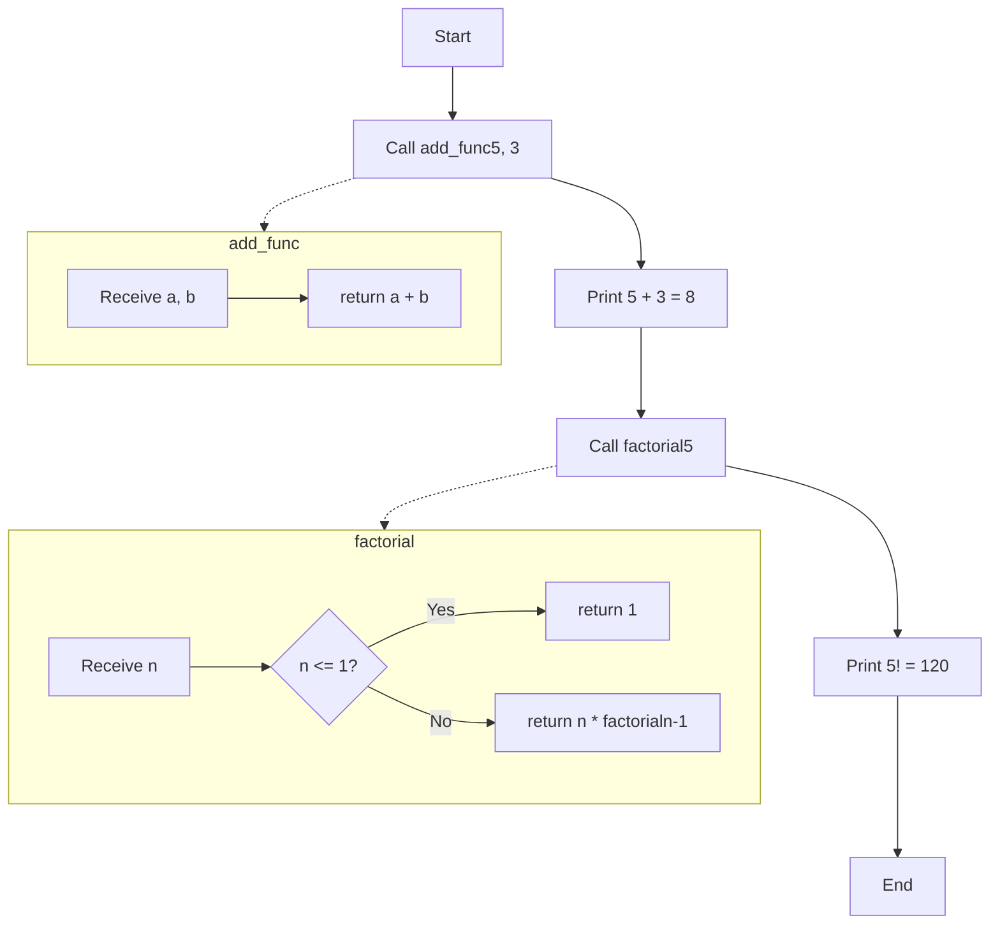
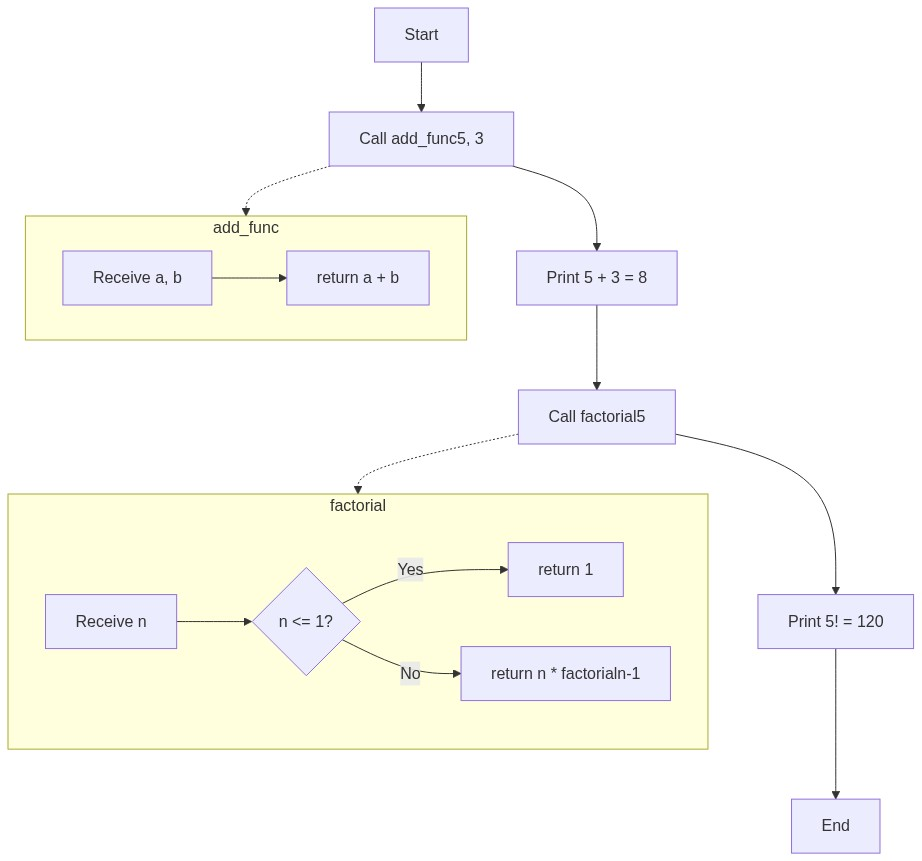

# المحاضرة التاسعة: الدوال والمكدس

---

## برامج منفصلة لكل مفهوم

| البرنامج | الملف | المفهوم |
|----------|-------|---------|
| دالة جمع | `lecture_09a_add_func.asm` | `jal`, `jr`, `$ra` |
| دالة مضروب | `lecture_09b_factorial.asm` | `$sp`, مكدس, recursion |

---

## شرح كل أمر

### `jal add`

- **jal** = Jump And Link (اقفز واربط)
  1. احفظ عنوان السطر الذي بعد `jal` في `$ra`
  2. اقفز إلى label `add`
- في C++: `result = add(5, 3);` (استدعاء دالة)
- `$ra` = Return Address = بمثابة "رابط الرجوع"

### `jr $ra`

- **jr** = Jump Register (اقفز باستخدام register)
- ارجع إلى العنوان الموجود في `$ra`
- `$ra` = الذي حفظه `jal` قبل ذلك
- في C++: `return result;` (رجوع من دالة)

### `$a0, $a1` (argument registers)

- `$a0` = أول معامل للدالة
- `$a1` = ثاني معامل
- في C++: `add(a0, a1)` ← `a0` و `a1` هما الـ arguments

### `$v0` (return value register)

`$v0` = القيمة التي أعادتها الدالة. في C++: `return v0;`

### Stack (المكدس)

```
addi $sp, $sp, -8    # احجز 8 بايت في المكدس (تحريك $sp لأسفل)
sw   $ra, 0($sp)     # احفظ $ra في المكدس
sw   $a0, 4($sp)     # احفظ $a0 في المكدس
... body ...
lw   $ra, 0($sp)     # استرجع $ra من المكدس
addi $sp, $sp, 8     # حرّر 8 بايت (تحريك $sp لأعلى)
```

- `$sp` = Stack Pointer (مؤشر المكدس)
- المكدس ينمو للأسفل (عناوين أقل)
- **لماذا نحفظ `$ra`؟** لأن أي `jal` آخر سيغير `$ra` وسنفقد عنوان الرجوع الأصلي!

### لماذا المكدس ضروري للـ recursion؟

`factorial` يستدعي نفسه:
- `jal factorial` → يغير `$ra` للعنوان الجديد
- `jal` مرة أخرى → يغير `$ra` مرة أخرى
- إذا لم نحفظ `$ra` القديم، ننسى إلى أين نعود!

### لماذا نستخدم `$s0-$s7` وليس `$t0-$t9` في الدوال؟

- `$s` = saved — قيمتها تضمن أنها تبقى محفوظة
- `$t` = temporary — قد تتغير بعد استدعاء دالة

---

## الكود

```mips
.data
    msg_add: .asciiz "5 + 3 = "
    msg_fact: .asciiz "5! = "
    newline: .asciiz "\n"

.text
main:
    # ========================================
    # مثال J: دالة add — اجمع رقمين
    # C++:
    #   int add(int a, int b) { return a + b; }
    #   int main() { int r = add(5, 3); cout << r; }
    # ========================================
    la $a0, msg_add
    li $v0, 4
    syscall

    li $a0, 5                    # $a0 = 5  (المعامل الأول)
    li $a1, 3                    # $a1 = 3  (المعامل الثاني)
    jal add_func                 # استدعِ add ← يحفظ $ra ويقفز

    move $a0, $v0                # $v0 = النتيجة (8)
    li $v0, 1
    syscall
    la $a0, newline
    li $v0, 4
    syscall

    # ========================================
    # مثال K: factorial — 5!
    # C++:
    #   int factorial(int n) {
    #       if (n <= 1) return 1;
    #       return n * factorial(n - 1);
    #   }
    # ========================================
    la $a0, msg_fact
    li $v0, 4
    syscall

    li $a0, 5                    # $a0 = 5
    jal factorial

    move $a0, $v0
    li $v0, 1
    syscall

    li $v0, 10
    syscall

# ========================================
# الدالة add_func: $v0 = $a0 + $a1
# ========================================
add_func:
    add $v0, $a0, $a1           # $v0 = $a0 + $a1
    jr $ra                      # ارجع إلى main

# ========================================
# الدالة factorial: تحتاج مكدس (recursion)
# ========================================
factorial:
    addi $sp, $sp, -8           # احجز 8 بايت في المكدس
    sw $ra, 0($sp)              # احفظ $ra
    sw $a0, 4($sp)              # احفظ $a0

    li $t0, 1
    ble $a0, $t0, base_case     # إذا n <= 1 → base case

    addi $a0, $a0, -1           # n - 1
    jal factorial               # factorial(n-1)
    lw $a0, 4($sp)              # استرجع n الأصلي
    mul $v0, $a0, $v0           # n * factorial(n-1)
    b return_fact

base_case:
    li $v0, 1

return_fact:
    lw $ra, 0($sp)              # استرجع $ra
    addi $sp, $sp, 8            # حرّر المكدس
    jr $ra
```

---

## خلاصة التعليمات الجديدة

| الأمر | المعنى | C++ مقابل |
|-------|--------|-----------|
| `jal label` | استدعاء دالة (يحفظ `$ra`) | `result = func()` |
| `jr $ra` | رجوع من دالة | `return result` |
| `$ra` | عنوان الرجوع | return address |
| `$sp` | مؤشر المكدس | stack pointer |
| `$a0-$a3` | معاملات الدالة | function arguments |
| `$v0` | قيمة رجوع الدالة | return value |

### إدارة المكدس

| العملية | الكود | الشرح |
|---------|------|-------|
| حجز مساحة | `addi $sp, $sp, -8` | حرّك $sp لأسفل 8 بايت |
| حفظ قيمة | `sw $ra, 0($sp)` | احفظ في المكدس |
| استرجاع قيمة | `lw $ra, 0($sp)` | خذ من المكدس |
| تحرير مساحة | `addi $sp, $sp, 8` | حرّك $sp لأعلى 8 بايت |

---

## مخطط سير الخوارزمية (Flowchart)




