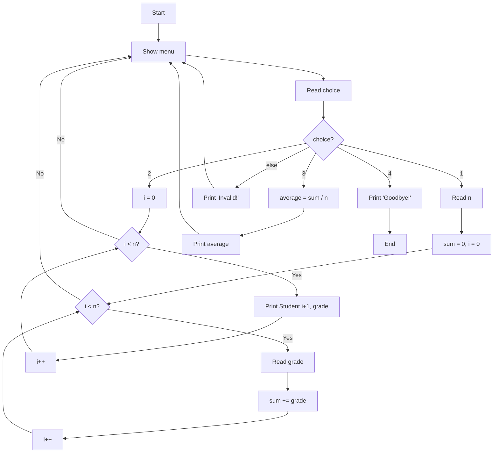
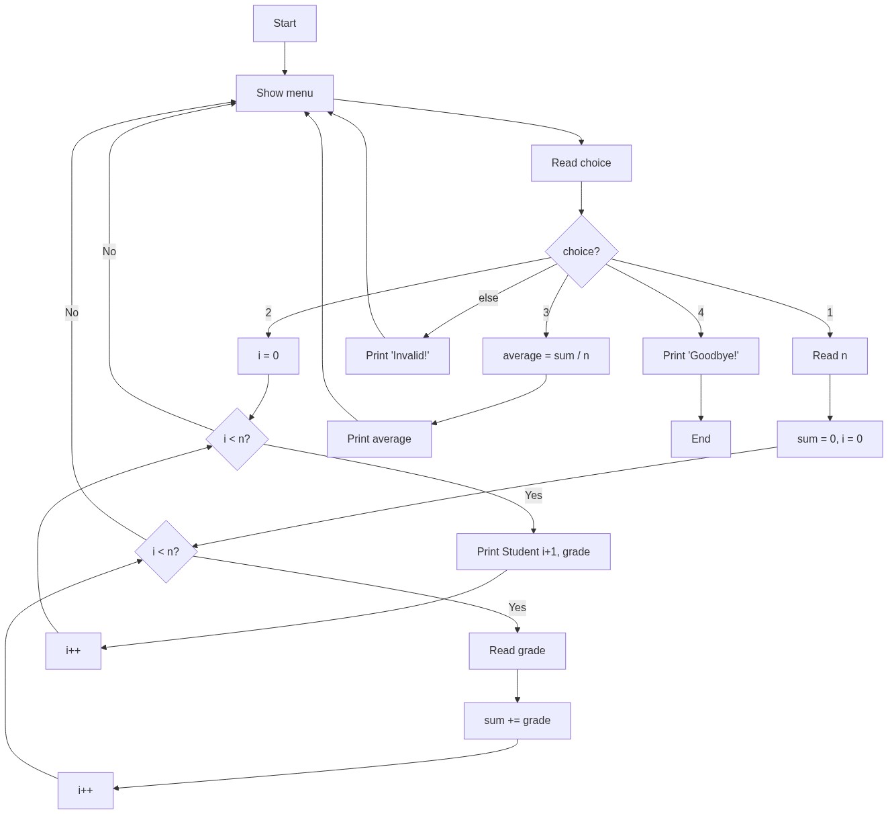

# المحاضرة العاشرة: المشروع النهائي - نظام درجات الطلاب

> هذا المشروع **يجمع كل ما تعلمناه** في المحاضرات السابقة.

---

## المفاهيم المطبقة

| المفهوم | المكان في الكود |
|---------|----------------|
| `.space`, `lw`, `sw` → الذاكرة | `grades: .space 200` |
| `sll`, `add` → المصفوفة | `sll ... add ... sw/lw` |
| `beq`, `bgt` → الشروط | اختيار من القائمة |
| `addi`, `b` → الحلقات | الإدخال والعرض |
| `div`, `mflo` → القسمة | حساب المتوسط |

---

## برامج منفصلة لكل مفهوم

بدلاً من برنامج واحد كبير، قسّمنا المشروع إلى 3 برامج صغيرة، كل واحد يركز على مفهوم واحد:

| البرنامج | الملف | المفهوم |
|----------|-------|---------|
| إدخال الدرجات | `lecture_10a_input.asm` | مصفوفة، حلقات، `sw` |
| عرض الدرجات | `lecture_10b_display.asm` | مصفوفة، حلقات، `lw` |
| حساب المتوسط | `lecture_10c_average.asm` | مصفوفة، قسمة `div`/`mflo` |

الملف الأصلي `lecture_10.asm` يبقى كاملًا كمرجع.

---

## شرح الكود

### المتغيرات

| الاسم | النوع | الاستخدام |
|-------|------|-----------|
| `grades` | `.space 200` | مصفوفة 50 درجة (50 × 4 بايت) |
| `n` | `.word 0` | عدد الطلاب |
| `sum` | `.word 0` | مجموع الدرجات |

### القائمة (Menu)

نطبع الخيارات ونقرأ `choice` من المستخدم. نستخدم `beq` لنرى أي اختيار.
إذا لم يكن 1,2,3,4 → نطبع "Invalid" ونعود مرة أخرى.

### Option 1: Enter grades

```
اقرأ n (عدد الطلاب)
اضبط sum = 0
loop:
    اقرأ درجة
    احسب العنوان: sll $t1, $i, 2
    خزّن:          sw $val, 0($t1)
    جمع:          sum += val
    i++
```

### Option 2: Display grades

```
loop على المصفوفة:
    احسب عنوان arr[i]
    اطبع "Student i: grade"
```

### Option 3: Average

`المتوسط = sum / n`. نستخدم `div` و `mflo` (قسمة صحيحة — الناتج مقطوع، بدون كسور).

### Option 4: Exit

`syscall 10`

---

## الكود

```mips
.data
    grades: .space 200            # مصفوفة 50 درجة  (50 × 4)
    n:      .word 0               # عدد الطلاب
    sum:    .word 0               # مجموع الدرجات

    menu:   .asciiz "\n1. Enter grades\n2. Display grades\n3. Show average\n4. Exit\nChoice: "
    msg_n:  .asciiz "Number of students: "
    msg_g:  .asciiz "Grade: "
    msg_d:  .asciiz "\n--- Grades ---\n"
    msg_s:  .asciiz "Student "
    msg_c:  .asciiz ": "
    msg_a:  .asciiz "Average = "
    msg_e:  .asciiz "Goodbye!\n"
    inv:    .asciiz "Invalid!\n"
    newline: .asciiz "\n"

.text
main:

    # ========================================
    # القائمة — اختر من 1 إلى 4
    # ========================================
menu:
    la $a0, menu
    li $v0, 4
    syscall
    li $v0, 5
    syscall
    move $t0, $v0                # $t0 = choice

    beq $t0, 1, option1
    beq $t0, 2, option2
    beq $t0, 3, option3
    beq $t0, 4, exit
    la $a0, inv                  # اختيار خاطئ
    li $v0, 4
    syscall
    b menu

    # ========================================
    # Option 1: إدخال الدرجات
    # ========================================
option1:
    la $a0, msg_n                # اسأل عن عدد الطلاب
    li $v0, 4
    syscall
    li $v0, 5
    syscall
    sw $v0, n                    # n = عدد الطلاب

    sw $zero, sum                # sum = 0

    la $s0, grades
    lw $s1, n
    li $t0, 0                    # i = 0

input:
    bge $t0, $s1, done_input

    la $a0, msg_g
    li $v0, 4
    syscall
    li $v0, 5
    syscall

    sll $t1, $t0, 2              # i × 4
    add $t1, $s0, $t1            # عنوان grades[i]
    sw $v0, 0($t1)               # grades[i] = v0

    lw $t2, sum
    add $t2, $t2, $v0
    sw $t2, sum                  # sum += v0

    addi $t0, $t0, 1
    b input
done_input:
    b menu

    # ========================================
    # Option 2: عرض الدرجات
    # ========================================
option2:
    la $a0, msg_d
    li $v0, 4
    syscall

    la $s0, grades
    lw $s1, n
    li $t0, 0

disp:
    bge $t0, $s1, done_disp

    la $a0, msg_s                # "Student "
    li $v0, 4
    syscall
    addi $a0, $t0, 1             # رقم الطالب
    li $v0, 1
    syscall
    la $a0, msg_c                # ": "
    li $v0, 4
    syscall

    sll $t1, $t0, 2
    add $t1, $s0, $t1
    lw $a0, 0($t1)               # grades[i]
    li $v0, 1
    syscall

    la $a0, newline
    li $v0, 4
    syscall

    addi $t0, $t0, 1
    b disp
done_disp:
    b menu

    # ========================================
    # Option 3: المتوسط (sum / n)
    # ========================================
option3:
    la $a0, msg_a
    li $v0, 4
    syscall

    lw $t0, sum
    lw $t1, n
    div $t0, $t1
    mflo $a0                     # المتوسط (قسمة صحيحة)
    li $v0, 1
    syscall

    la $a0, newline
    li $v0, 4
    syscall
    b menu

    # ========================================
    # Option 4: خروج
    # ========================================
exit:
    la $a0, msg_e
    li $v0, 4
    syscall
    li $v0, 10
    syscall
```

---

## مخطط سير الخوارزمية (Flowchart)




