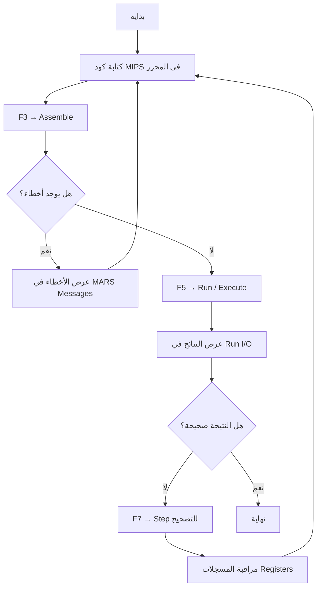
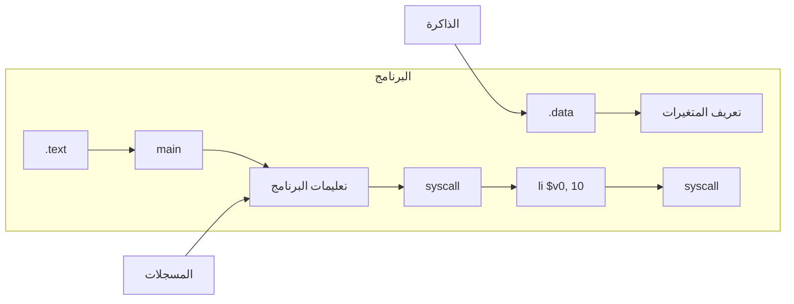
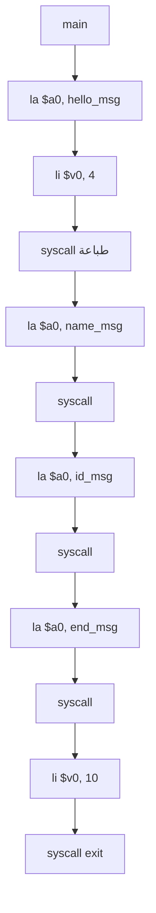
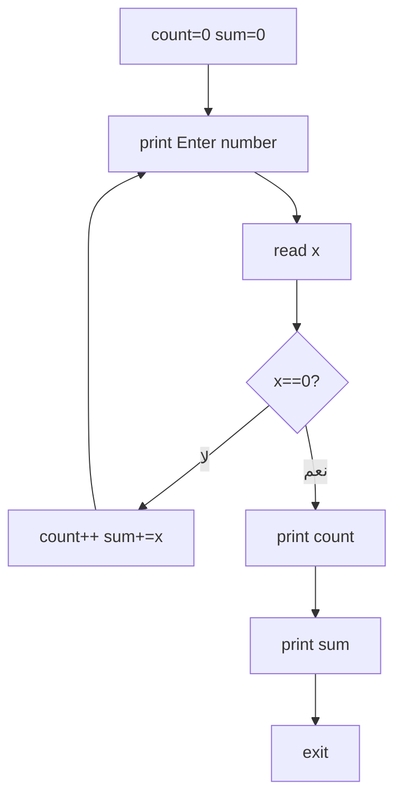

# تحليل المحاضرة الأولى: مقدمة إلى MARS وأساسيات MIPS

## الأهداف التعليمية
- التعرف على بيئة MARS ومكوناتها
- فهم هيكل برنامج MIPS الأساسي
- التعرف على أنواع المسجلات
- كتابة وتشغيل أول برنامج MIPS
- استخدام System Calls للطباعة والخروج
- **استخدام دليل "شرح العمل على برنامج MARS" كمرجع أثناء التثبيت والتشغيل**

## المفاهيم الأساسية
- **MARS**: محاكي تعليمي لمعالج MIPS (MIPS Assembler and Runtime Simulator)
- **Java Runtime**: منصة تشغيل أساسية يحتاجها MARS (JRE 7+؛ الدليل يستخدم jre-7u7)
- **JAR File**: ملف تطبيق Java قابل للتنفيذ (MARS يُوزع بهذه الصيغة — `Mars4_3.jar`)
- **مقطع البيانات (`.data`)**: تعريف المتغيرات والسلاسل النصية في الذاكرة
- **مقطع النص (`.text`)**: كتابة التعليمات البرمجية القابلة للتنفيذ
- **المسجلات**: ذاكرة سريعة داخل المعالج (32 مسجلاً لأغراض مختلفة)
- **System Call**: واجهة بين برنامج المستخدم ونظام التشغيل (الخدمات: طباعة، إدخال، خروج)
- **Assemble (F3)**: ترجمة كود MIPS إلى لغة الآلة
- **Execute/Run (F5)**: تنفيذ البرنامج المُجمّع
- **Step (F7)**: تنفيذ تعليمة واحدة كل مرة (للتصحيح والتحليل)
- **Breakpoint (Bkpt)**: نقطة توقف يتوقف عندها التنفيذ

## أهداف التثبيت والتعرف على البيئة (من دليل شرح العمل على MARS)
1. فك ضغط حزمة `CA-Tools.rar` باستخدام WinRAR
2. تثبيت Java Runtime من `jre-7u7-windows-i586.exe`
3. تشغيل `Mars4_3.jar` والتحقق من ظهور النافذة الرئيسية
4. التعرف على النوافذ الرئيسية: Edit, Registers, Text Segment, Data Segment, Run I/O, MARS Messages, Coproc 0, Coproc 1
5. فتح ملف `mips001.asm` من File → Open
6. تجميع البرنامج (F3 → Assemble)
7. تشغيل البرنامج (F5 → Execute)
8. التنفيذ خطوة بخطوة (F7 → Step)
9. عرض المسجلات: Name, Number, Value
10. عرض Data Segment بصيغة Hexadecimal و ASCII

## واجهة MARS — نوافذها الرئيسية (حسب الدليل)

| النافذة | المحتوى |
|---------|---------|
| **Edit** | محرر النصوص لكتابة كود MIPS |
| **Registers** | المسجلات العامة (Name, Number, Value) + Coproc 0 + Coproc 1 |
| **Text Segment** | الكود المُجمّع: Bkpt (نقطة توقف), Address, Code, Basic (machine code), Source |
| **Data Segment** | البيانات: Address, Value (+x) بصيغة Hexadecimal + ASCII |
| **Run I/O** | نافذة الإدخال/الإخراج للتفاعل مع البرنامج |
| **MARS Messages** | رسائل الأخطاء والإشعارات أثناء التجميع والتشغيل |

## الأخطاء الشائعة المتوقعة
1. نسيان كتابة `.data` أو `.text`
2. استخدام مسجل غير مهيأ (بدون قيمة)
3. الخلط بين `$a0` (معامل) و `$v0` (رقم الخدمة)
4. نسيان `syscall` بعد تعيين القيم
5. عدم تثبيت Java لتشغيل MARS (الخطأ: "Java not found" — يظهر ملف JAR كملف مضغوط)
6. عدم فك ضغط `CA-Tools.rar` قبل الاستخدام
7. تنزيل إصدار Java غير متوافق مع MARS

## أسئلة للمناقشة
1. لماذا نحتاج إلى لغة التجميع إذا كان لدينا لغات مثل Python و C++؟
2. كيف يختلف برنامج MIPS عن برنامج C++ من حيث التنفيذ؟
3. ماذا يحدث إذا لم نستخدم `li $v0, 10` في نهاية البرنامج؟

## مؤشرات النجاح
- ✅ تشغيل MARS بنجاح
- ✅ كتابة برنامج يطبع نصاً
- ✅ فهم الفرق بين `.data` و `.text`
- ✅ إنهاء البرنامج بشكل صحيح

## المراجع والموارد المساعدة
- **دليل MARS (PDF):** `أدوات/شرح العمل على برنامج mars.pdf` — دليل مصور يشرح جميع خطوات العمل
- **حزمة الأدوات:** `أدوات/CA-Tools.rar` — تحتوي على MARS (`Mars4_3.jar`)، Java JRE، Logisim
- **مثال mips001.asm:** برنامج تفاعلي يقرأ الأعداد ويجمعها حتى إدخال الصفر (مطابق للمثال في الدليل)
- **خريطة المسجلات:** مفيدة كمرجع سريع للطلاب عند كتابة الأوامر

## توصيات للمحاضر
- تأكد من تثبيت Java على جميع أجهزة المختبر قبل المحاضرة
- وزع Reference Card لتعليمات MIPS على الطلاب
- شجع الطلاب على استكشاف واجهة MARS بأنفسهم
- أحلّ الطلاب على دليل "شرح العمل على برنامج MARS" لمتابعة الخطوات أثناء التثبيت
- يمكن فك ضغط `CA-Tools.rar` باستخدام WinRAR أو 7-Zip

---

## المخططات التوضيحية

### مخطط سير العمل في MARS

### مخطط هيكل برنامج MIPS

### مخطط برنامج Hello World (lecture_01.asm)

### مخطط برنامج جمع الأعداد (mips001.asm)

