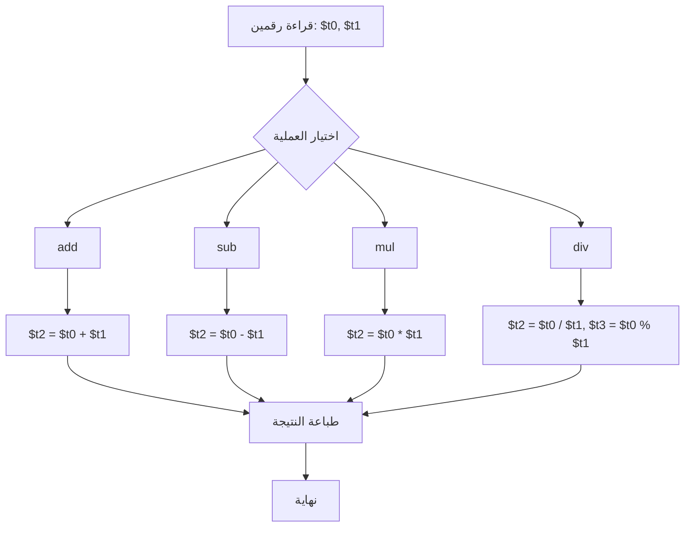
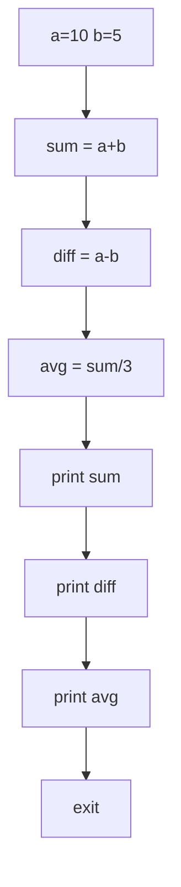

# تحليل المحاضرة الثانية: العمليات الحسابية الأساسية

## الأهداف التعليمية
- إتقان تعليمات الجمع والطرح في MIPS
- فهم الفرق بين `add` و `addi`
- التعامل مع إدخال وطباعة الأعداد الصحيحة
- التعرف على مفهوم التجاوز (Overflow)

## المفاهيم الأساسية
- **R-Type (Register)**: تعليمات تستخدم المسجلات فقط — `add`, `sub`
- **I-Type (Immediate)**: تعليمات تحتوي على قيمة فورية — `addi`
- **System Call 5**: قراءة عدد صحيح من لوحة المفاتيح
- **Overflow**: تجاوز سعة المسجل (32 بت) عند إجراء عملية حسابية

## الأخطاء الشائعة المتوقعة
1. الخلط بين `add` و `addi` (استخدام `addi` مع 3 مسجلات)
2. استخدام مسجلات غير مهيأة (تحتوي على قيم عشوائية)
3. نسيان قراءة القيمة من `$v0` بعد `syscall`
4. عدم إنهاء البرنامج بـ `li $v0, 10` / `syscall`

## أسئلة للمناقشة
1. ماذا يحدث إذا جمعنا رقمين والناتج أكبر من 2³¹-1؟
2. لماذا لا توجد تعليمة `subi` في MIPS؟
3. كيف تمثل MIPS الأرقام السالبة؟

## مؤشرات النجاح
- ✅ كتابة برنامج يقرأ رقمين ويجمعهما
- ✅ كتابة برنامج يقرأ رقمين ويطرحهما
- ✅ استخدام `addi` مع الثوابت
- ✅ التعامل الصحيح مع System Call للإدخال

## توصيات للمحاضر
- استخدم أرقاماً صغيرة في البداية لتجنب الـ Overflow
- اشرح تمثيل الأرقام السالبة (Two's Complement) باختصار
- شجع الطلاب على تجربة قيم كبيرة لرؤية الـ Overflow

---

## المخططات التوضيحية

### مخطط العمليات الحسابية في MIPS

### مخطط برنامج العمليات الحسابية (lecture_02.asm)

