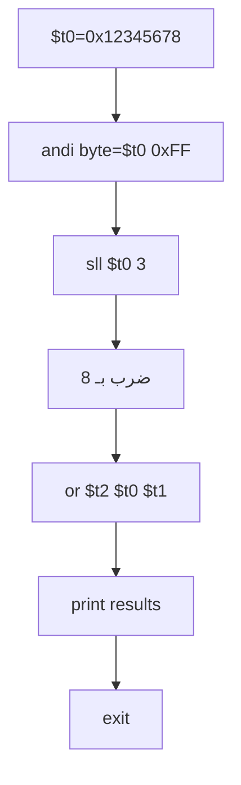

# تحليل المحاضرة الثالثة: العمليات المنطقية وإزاحة البتات

## الأهداف التعليمية
- فهم العمليات المنطقية على مستوى البتات
- استخدام تعليمات الإزاحة للضرب والقسمة السريع
- تطبيق الأقنعة (Masks) لعزل وتعديل البتات
- فهم الفرق بين الإزاحة المنطقية والحسابية

## المفاهيم الأساسية
- **Bitwise AND**: تصفية البتات — 1 فقط إذا كان كلا البتين 1
- **Bitwise OR**: تعيين البتات — 1 إذا كان أي من البتين 1
- **Bitwise XOR**: عكس البتات — 1 إذا اختلف البتان
- **Logical Shift**: إزاحة البتات مع ملء الفراغات بالأصفار
- **Mask**: قناع بتنسيق ثنائي لعزل بتات معينة

## الأخطاء الشائعة المتوقعة
1. عدم فهم الفرق بين الإزاحة المنطقية (`srl`) والحسابية (`sra`)
2. نسيان أن الإزاحة بمقدار 1 تعادل الضرب/القسمة على 2
3. استخدام قناع خاطئ (مثلاً 8 بدلاً من 0xFF)
4. الخلط بين `and` المنطقي و `and` الشرطي في لغات C/C++

## أسئلة للمناقشة
1. لماذا `sll` أسرع من `mul` في المعالجات القديمة؟
2. كيف نستخدم `and` لمعرفة إذا كان الرقم زوجياً أم فردياً؟
3. ما الفرق بين `srl` و `sra`؟

## مؤشرات النجاح
- ✅ ضرب رقم في 4 باستخدام `sll`
- ✅ استخدام `and` لعزل بايت معين من كلمة
- ✅ استخدام `or` لتعيين بت معين
- ✅ استخدام `xor` لعكس بت معين

## توصيات للمحاضر
- استخدم السبورة لرسم التمثيل الثنائي والبتات
- ابدأ بأمثلة بسيطة (4 بتات) قبل الانتقال إلى 32 بت
- بين التطبيق العملي: كيف تستخدم الإزاحة في ضغط البيانات والتشفير


---

## المخططات التوضيحية

### مخطط العمليات المنطقية وإزاحة البتات

```mermaid
flowchart LR
    A[$t0 = 0b1100] --> B[and $t2, $t0, $t1]
    A --> C[or $t2, $t0, $t1]
    A --> D[nor $t2, $t0, $t1]
    A --> E[xor $t2, $t0, $t1]
    B --> F[نتيجة = 1 فقط إذا كان كلا البتّين 1]
    C --> G[نتيجة = 1 إذا كان أحدهما على الأقل 1]
    D --> H[نتيجة = NOT (A OR B)]
    E --> I[نتيجة = 1 إذا كان البتان مختلفين]
    J[$t0 = 0b0001] --> K[sll $t0, 2]
    K --> L[إزاحة لليسار: 0b0100]
    M[$t0 = 0b1000] --> N[srl $t0, 2]
    N --> O[إزاحة لليمين: 0b0010]
```


### مخطط برنامج العمليات المنطقية (lecture_03.asm)


