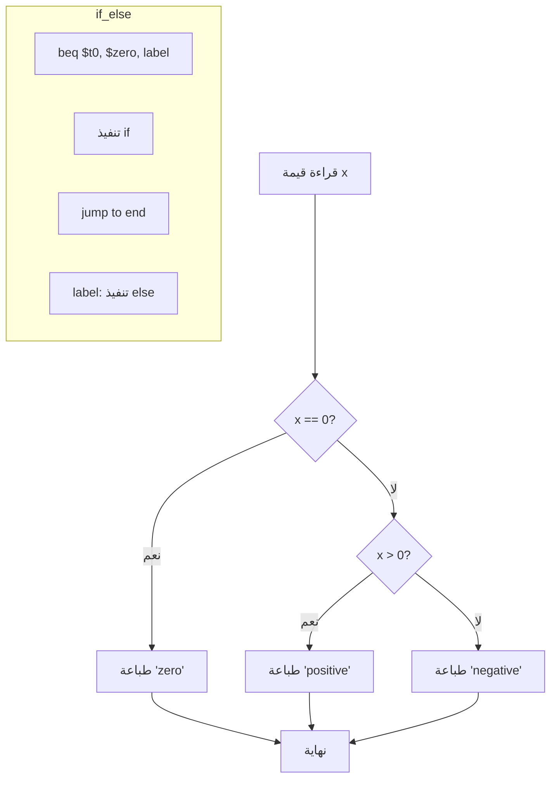
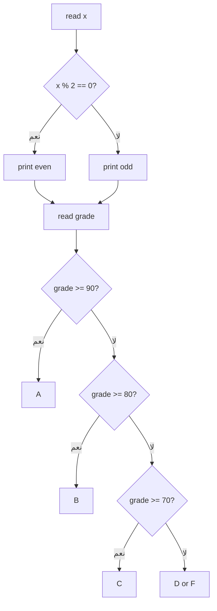

# تحليل المحاضرة الرابعة: الجمل الشرطية

## الأهداف التعليمية
- فهم تعليمات التفرع الشرطي `beq` و `bne`
- استخدام `slt` للمقارنات الكمية
- ترجمة جمل if-else من C/C++ إلى MIPS
- تصميم مخطط انسيابي قبل البرمجة

## المفاهيم الأساسية
- **Branch Instruction**: تعليمة تغير مسار التنفيذ بناءً على شرط
- **PC-Relative Addressing**: التفرع باستخدام إزاحة نسبية من عداد البرنامج
- **Set on Less Than**: تعليمة مقارنة تنتج 1 أو 0
- **Flowchart**: مخطط بياني لتمثيل الخوارزمية
- **Flag**: بت يشير إلى نتيجة مقارنة سابقة (في معالجات أخرى)

## الأخطاء الشائعة المتوقعة
1. عكس الشرط — استخدام `beq` بدلاً من `bne` (أو العكس)
2. نسيان القفز لتجاوز قسم `else` بعد تنفيذ `if`
3. استخدام `slt` بشكل خاطئ لتكوين شرط أكبر من (`>`)
4. عدم وضع label في المكان الصحيح

## أسئلة للمناقشة
1. كيف تحقق `if (x > y)` باستخدام `slt` فقط؟
2. ما الفرق بين `beq` و `bne` من حيث التنفيذ في المعالج؟
3. لماذا نحتاج `j` (قفز غير مشروط) بعد كتلة `if`؟

## مؤشرات النجاح
- ✅ كتابة if-else كامل في MIPS
- ✅ استخدام `slt` بشكل صحيح
- ✅ تحويل كود C يحتوي على if-else if-else
- ✅ رسم Flowchart يوضح مسار التنفيذ

## توصيات للمحاضر
- اشرح أولاً باستخدام Flowchart على السبورة
- ابدأ بكود C مبسط جداً ثم ترجمته إلى MIPS
- ركز على الفرق بين `beq` (if equal) و `bne` (if not equal)
- استخدم ألوان مختلفة لتوضيح كتلة if و else

---

## المخططات التوضيحية

### مخطط الجمل الشرطية

### مخطط برنامج الجمل الشرطية (lecture_04.asm)

