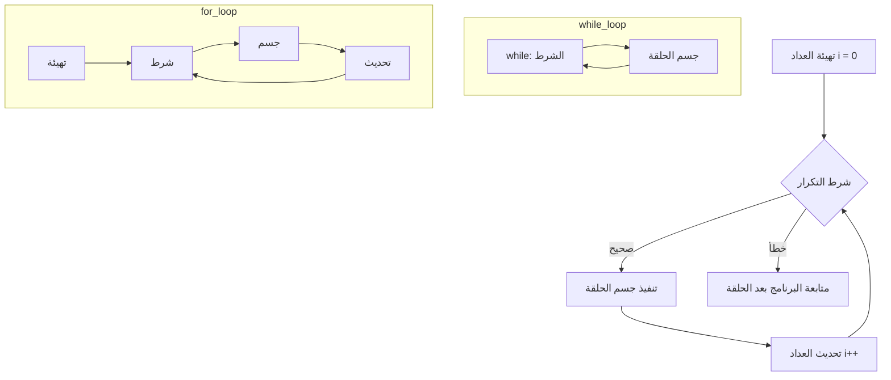
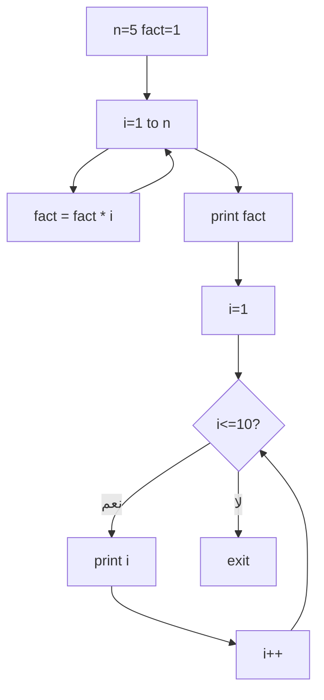

# تحليل المحاضرة الخامسة: حلقات التكرار

## الأهداف التعليمية
- فهم كيفية بناء حلقات التكرار في لغة التجميع
- ترجمة حلقات `while` و `for` إلى MIPS
- إدارة عدادات الحلقات بشكل صحيح
- تجنب الحلقات اللانهائية

## المفاهيم الأساسية
- **Unconditional Jump** (`j`): قفز بدون شرط إلى label
- **Loop Counter**: مسجل يتتبع عدد التكرارات
- **Loop Condition**: شرط الخروج من الحلقة
- **Infinite Loop**: حلقة لا نهائية — شرطها دائماً صحيح
- **Nested Loop**: حلقة داخل حلقة

## الأخطاء الشائعة المتوقعة
1. نسيان تحديث العداد داخل الحلقة → حلقة لا نهائية
2. وضع شرط الخروج في المكان الخطأ
3. عدم تهيئة العداد قبل الدخول إلى الحلقة
4. الخلط بين `j` (قفز) و `jal` (قفز مع حفظ عنوان العودة)

## أسئلة للمناقشة
1. ما الفرق بين `while` و `for` على مستوى لغة التجميع؟
2. كيف نكتشف الحلقة اللانهائية في MARS؟
3. لماذا نحتاج إلى 3 أجزاء في الحلقة: تهيئة، شرط، تحديث؟

## مؤشرات النجاح
- ✅ كتابة حلقة `for` تطبع الأرقام من 1 إلى N
- ✅ كتابة حلقة `while` تحسب Factorial
- ✅ استخدام عداد حلقة وتحديثه
- ✅ الخروج الصحيح من الحلقة

## توصيات للمحاضر
- ارسم هيكل الحلقة على السبورة قبل كتابة الكود
- أظهر الفرق بين حلقة تعمل وحلقة لا نهائية
- استخدم Debugger في MARS لتتبع تغير قيم العداد خطوة بخطوة
- شجع الطلاب على تخمين عدد مرات التكرار قبل التنفيذ

---

## المخططات التوضيحية

### مخطط حلقات التكرار

### مخطط برنامج المضروب والتكرار (lecture_05.asm)

