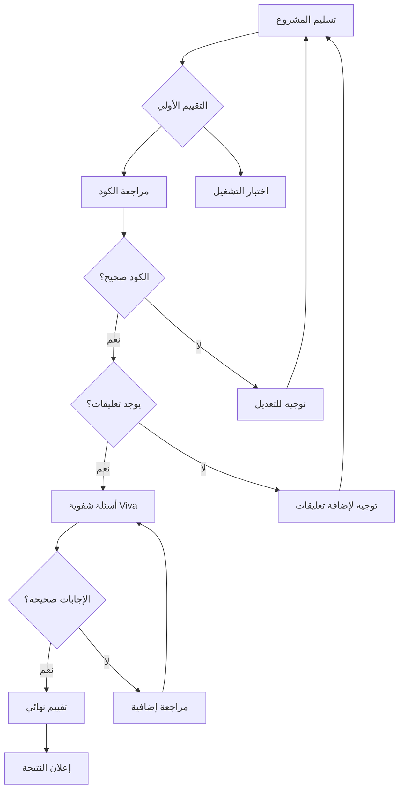

# تحليل المحاضرة العاشرة: مناقشة وتقييم المشروع النهائي

## الأهداف التعليمية
- دمج جميع مفاهيم MIPS في مشروع واحد متكامل
- تقييم قدرة الطلاب على بناء نظام برمجي متكامل
- قياس فهم الطلاب من خلال المناقشة الشفوية
- مقارنة الحلول المختلفة وتحسين جودة الكود

## ملخص المهارات المطلوبة في المشروع

| المهارة | التطبيق في المشروع |
|---------|-------------------|
| System Calls | طباعة القوائم، إدخال الدرجات، الخروج |
| Arrays | تخزين درجات 5 طلاب في مصفوفة |
| Loops | المرور على عناصر المصفوفة للحسابات |
| Conditional Statements | تحديد الناجح/الراسب، المقارنة لإيجاد الأعلى/الأدنى |
| Procedures | تنظيم الكود في دوال (إدخال، حساب، طباعة) |
| Memory Access | استخدام `lw`/`sw` للتعامل مع المصفوفة |

## الأخطاء الشائعة في المشروع
1. عدم تحديث مؤشر المصفوفة بمقدار 4
2. حلقات لا نهائية في قائمة الخيارات (Menu Loop)
3. عدم حفظ `$ra` عند استدعاء دوال داخل دوال
4. تجاوز حدود المصفوفة
5. نسيان إنهاء البرنامج بـ `li $v0, 10`
6. عدم وجود تعليقات (Documentation)

## مقارنة الحلول
- **حل باستخدام دوال منظمة**: كود قابل لإعادة الاستخدام، سهل التعديل ← 20/20 لجودة الكود
- **حل بدون دوال**: كود طويل ومكرر، صعب التعديل ← 10/20 لجودة الكود
- **حل مع تعليقات واضحة**: يشرح كل كتلة برمجية ← 20/20 للتوثيق
- **حل بدون تعليقات**: يصعب فهمه وتقييمه ← 5/20 للتوثيق

## مؤشرات النجاح
- ✅ البرنامج يعمل بجميع وظائفه
- ✅ الكود منظم ومقسم إلى دوال
- ✅ وجود تعليقات واضحة
- ✅ قدرة الطالب على شرح وتعديل الكود

## توصيات للمحاضر
- أعلن عن المشروع من المحاضرة الأولى مع معايير التقييم
- وفر قالب (Template) بسيط للبدء
- شجع الطلاب على العمل في أزواج (Pair Programming)
- خصص جزءاً من المحاضرة 9 لأسئلة وأجوبة عن المشروع
- جهز أسئلة Viva مختلفة لكل طالب (لتجنب الغش)
- قدم تغذية راجعة مفصلة بعد التقييم

---

## المخططات التوضيحية

### مخطط تقييم المشروع النهائي

